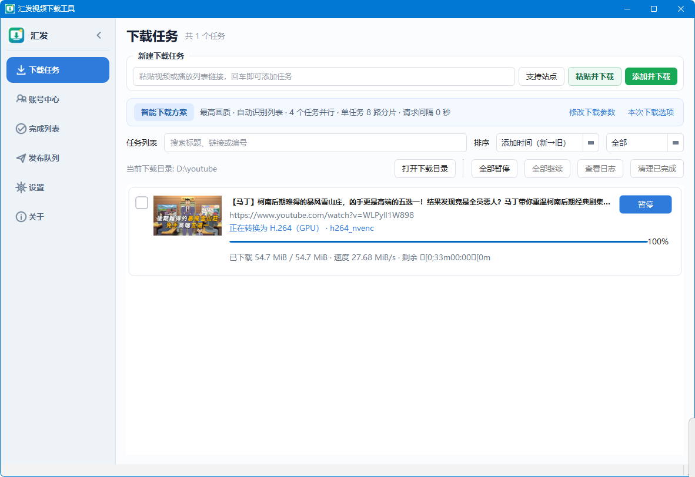

# 汇发媒体下载器

<p align="center">
  <strong>基于 yt-dlp 的 Windows 视频下载、媒体处理与多平台发布工具</strong>
</p>

<p align="center">
  <a href="README.md">简体中文</a> |
  <a href="README_EN.md">English</a>
</p>

<p align="center">
  <a href="https://github.com/jwwsjlm/huifa-media-downloader/releases/latest">下载最新版本</a> ·
  <a href="https://github.com/jwwsjlm/huifa-media-downloader/issues">反馈问题</a>
</p>



## 软件简介

汇发媒体下载器是一款面向 Windows 10/11 x64 的桌面应用。它使用 `yt-dlp` 解析视频、播放列表、频道及其他聚合链接，使用 FFmpeg 完成合并和转码，并提供 Cookie 登录、封面处理、字幕、任务管理与多平台发布工作流。

正式版本同时提供便携版 ZIP 和安装包 ZIP，二者都已经包含 Python 运行时和程序所需组件。普通用户无需安装 Python、Chrome、FFmpeg 或 yt-dlp。

## 主要功能

- 下载 yt-dlp 支持站点的单个视频、音频、播放列表、频道和合集。
- 聚合链接边解析边显示，可勾选需要下载的条目并以父子任务管理。
- 支持最高画质、常见分辨率和手动格式选择，以及字幕、音轨和仅音频下载。
- 显示解析、下载、合并、转码、封面和校验等阶段，以及进度、速度和预计剩余时间。
- 支持暂停、恢复、重试、批量操作、任务搜索和完成媒体管理。
- 使用 FFmpeg/FFprobe 进行合并与格式转换，并展示当前运行时可用的 CPU/GPU 编码器和硬件解码能力。
- 支持封面转为 JPG、裁切焦点、画面比例、任务独立文件夹和自定义临时处理目录。
- 使用软件内置的 Playwright Chromium 登录平台，Cookie 持久保存在软件本地目录。
- 可独立更新 yt-dlp、FFmpeg/FFprobe、Deno、yt-dlp-ejs 等运行组件。
- 通过 GitHub Releases API 检查程序更新，下载后校验 GitHub 提供的 SHA-256 digest。
- 下载完成后可创建多平台发布任务并在发布队列中统一管理。

## 下载与使用

1. 打开 [Releases](https://github.com/jwwsjlm/huifa-media-downloader/releases/latest)。
2. 便携使用请选择 `HuifaMediaDownloader-<版本>-portable-win-x64.zip`，完整解压后运行根目录的 `Huifa Media Downloader.exe`，不要只复制 EXE。
3. 需要安装到系统时请选择 `HuifaMediaDownloader-<版本>-installer-win-x64.zip`，解压后运行 `HuifaMediaDownloader-Setup.exe`。
4. 便携版数据默认保存在解压目录的 `data/`，下载内容默认保存在根目录 `downloads/`；移动软件时需要移动整个文件夹。安装版默认下载到系统“下载”目录下的 `Huifa Video Downloader/`，避免卸载软件时影响媒体文件。

便携版采用可自动更新的目录结构，FFmpeg、FFprobe、yt-dlp、Deno、yt-dlp-ejs 和 Chromium 位于软件自身的 `current/tools/` 中。Windows SmartScreen 提示未知发布者时，请先确认文件来自本仓库 Release，再决定是否运行。

## 便携数据

软件不会要求用户把数据放到“文档”目录，主要运行数据均位于程序旁的 `data/`：

- `data/app.db`：下载、媒体及发布任务数据库。
- `data/settings.ini`：软件设置。
- `data/browser/`：软件管理的浏览器资料和加密 Cookie 副本。
- `data/logs/`：任务诊断日志。
- `data/tools/`：可独立更新的本地运行组件。

便携版默认媒体目录是根目录 `downloads/`，不再与数据库、Cookie 等私有运行数据混放。yt-dlp-ejs 更新会遵循当前内置 yt-dlp 声明的固定配套版本；外置官方 `yt-dlp.exe` 已自带 EJS。

请勿公开上传整个 `data/` 目录，其中可能包含账号登录状态和私人任务信息。

## 从源码运行

```powershell
py -m venv .venv
.\.venv\Scripts\Activate.ps1
pip install -r requirements.txt
python -m playwright install chromium
python -m app.main
```

构建、运行时目录、自动更新和 GitHub Release 流程说明见 [开发与发布文档](docs/DEVELOPMENT.md)。

## 自动发布

推送与 `APP_VERSION` 一致的 `v<版本号>` tag 后，GitHub Actions 会在 Windows Runner 上执行测试、准备官方运行时、构建可整目录更新的便携版和安装版、生成 SHA-256 清单并发布 GitHub Release。

## 使用说明

请只下载、处理和发布你有权使用的内容。部分平台可能要求登录、验证码、双重验证或人工确认；平台规则和可用格式也可能随时变化。
